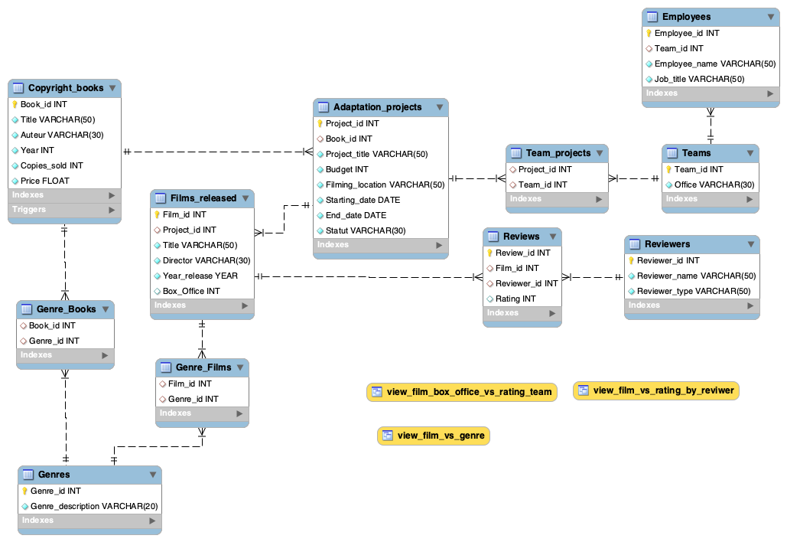

# Studio film adaptation database

## Overview

Relational database which contains 11 tables, all having a set of Primary and Foreign Key to create relations and normalise tables.
This project is about mimicking a film studio production, focusing on adapting movies from books. The database holds information about the different movie project, the team working on each project, the book where the project is adapted from, the budget, the genre, press review and award received.
In addition, various amounts of quires have been written in order to extract data and analyse information from the database.

Final project for course 'introduction' to SQL with [Code First Girls] (https://codefirstgirls.org.uk)

## Technologies
* SQL DataBase:
  * MySQL workbench --version 8.0.23
  * mysql --version 8.0.24

## Usage
** Back up *

```
mysqldump -u [user] -p Studio > [filename].sql
```
** Restore *

```
mysql -u [user] -p [database_name] < [filename].sql
```

For mac user, if mysql command not found
```
export PATH=$PATH:/usr/local/mysql/bin
```

## ER Diagram



## Files

* Core_requirements.sql
This file contains a list of queries in addition to stored function, stored procedure, views, trigger and event in order to meet project requirements and extract information from the database.
- a query that uses a trigger
- an event and a query to demonstrate how it runs
- views that uses at least 4 base tables;  with queries that uses the views to produce a logically arranged result set for analysis.
- a query with 'group by' and 'having to demonstrate' how to extract data
- stored function that can be applied to a query
- stored procedure that can be applied to a query
- query with a subquery to extract data for analysis


* Stuio_databse_creation.sql
Database design file that contains the code have created the database, table structure and data entrance.

* Studio_db_backup.sql
File to use if one wants to restore the database and use it.

* ER_Diagram.png
Screenshoot of the ER Diagram

* ERDiagram.mwb
ERDiagram saved file.

### Contact

Created by aude11
